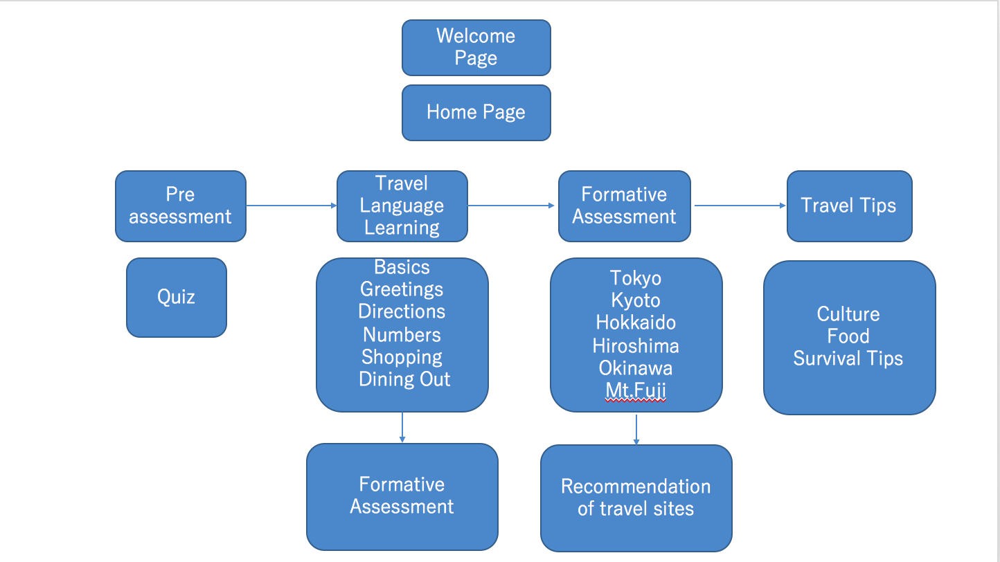
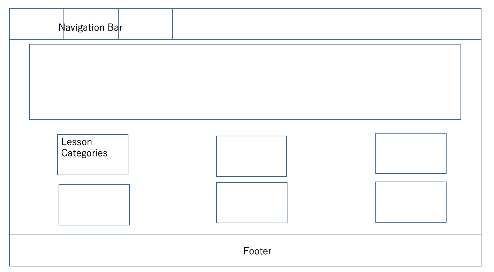

# midterm

# Topic: What is the subject at hand? Which broader field(s) does this site apply to?

###### This is a Language learning website for English speakers who are planning to travel to Japan and want to learn basic Japanese before traveling. Nowadays, with the technological development and globalization, more and more people start to travel around the world. It became cheaper and easier for people to go abroad. However, travelers often face problem of language barriers. There are many countries which do not speak English, or any other languages other than the local ones. Travelers may face difficulties in variety of daily life situations such as eating food, getting on a transportation, staying at a hotel, and greeting people etc. While they do not intend to master a language, they may want to understand and be able to use basic language that they will need to survive during traveling, which can make their traveling experience more enjoyable and memorable.

# Problem: What is the problem you're trying to solve?
###### There have been an increasing number of tourists coming in to Japan in recent years. Yet, Japanese people are not good at speaking English at all.  Travelers may face difficulties in dealing with daily life situations. If they were able to understand some basic conversation language, it will help them have smooth traveling experience.Furthermore, Japanese culture and customs may be very unique and possibly cause misunderstanding or miscommunication. Having Understanding of those cultural aspects will be useful and also can be  an interesting experience for travelers.Hopefully, this website will expand to other countries.

# Target Audience: Who is your target audience? Describe in detail
## User Stories
### User Story 1: A 31 years old American man, who has no Japanese learning background at all, is planning on his first visit to Japan. He will be visiting Japan in one week and hoping to learn basic Japanese vocab and sentences so that it will make his traveling experience easier.
###He made use of the basic traveling vocab practice, and was able to remember some useful words

### User Story 2: A 22 years old Chinese girl (who speaks English), who has no official Japanese learning background,but interested in starting to learn upon on her travel to Japan. She is now planing her travel and wants to know some reccomendation on where to visit. She wants to know must visit, must do , must eat things in Japan.
### She She used the website to get some information about recommended places to visit. She was able to learn the language in the context of traveling.

### User Story 3: A five-member Indonesian family( who speaks English) is planning to travel to Japan in coming May. They are now planing their travel and have some concern about the language,since they heard that Japanese people do not speak English very well. They also have some concern about Japanese unique culture, and wants to know some things to be careful, so that whatever they do won't offend local people, or considered to be rude. They also wants to know some tips in traveling, such as wifi info, and transportation.
### The family used the website to learn some basic vocabulary, and also learned some cultural issues to be careful about. They are equipped with useful tips upon traveling to Japan, and were able to have great traveling experience.

# Strategy
## Site Objectives:
###### ・Users will be able to understand and use basic vocabulary and sentences during traveling by studying last minute
###### ・User will be able to enjoy the trip and have no problem in doing what they want during travel. It should make their traveling experience more smooth and enjoyable.
######・Users are informed with places to visit in Japan, things to eat, cultural things to be careful of, and some useful tips which can make their traveling experience more comfortable and exciting.

# Success Metrics:
###### ・Pre assessment: Sine this website is targeted for people who wants to study only for the purpose of traveling, users will be a beginner level. It provides very basic Japanese vocab quiz in the beginning, which will assess their knowledge on basic Japanese language related to travel.
###### ・Formative assessment: After the practice, users will be tested for the knowledge they learned. In the map of Japan, they will be asked to answer the questions related to traveling, and if they answer successfully, they will be navigated to go to the map of area they want to visit.

# Scope: Functional and Content Specifications
###### This website is targeted for people with no background knowledge in Japanese language, and hoping to learn some useful vocabulary and sentences for traveling purpose in short amount of time. Thus, the contents are mainly based on travel related languages. First, they will be tested on how much they know of Japanese vocab. The contents include language practice: Basics/Greetings/Directions/Shopping/Numbers/Dining out. Also, it provides location based language learning. Learners will be able to practice what they learned on this section. It provides location of most popular traveling places: Tokyo, Kyoto, Hokkaido, Hiroshima, Okinawa, Mt.Fuji. If they answer the quiz correctly, they will be navigated to the location they want to visit. Furthermore, users will find information about reccomendation of visits. Users will also able to get information about some cultural tips, food, and survival tips.

# Structure: Interaction design and information architecture

# Skeleton: Interface, navigation, information design (You'll provide wireframes here)

